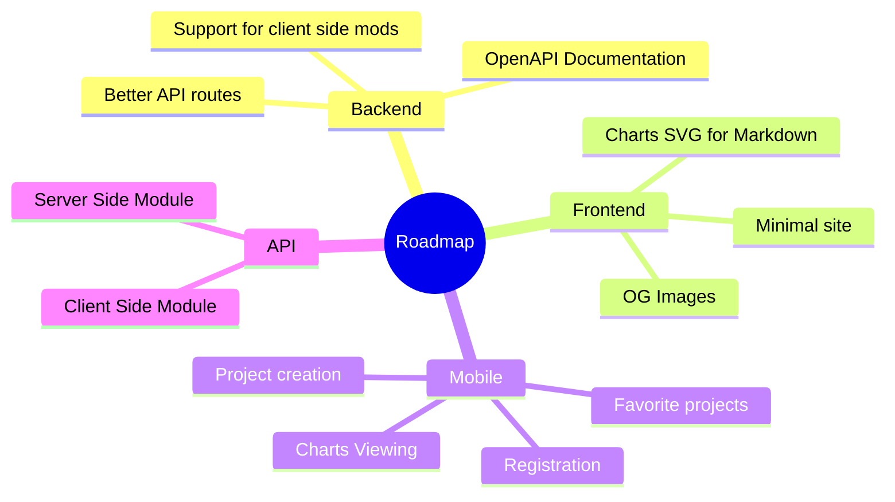

<a name="readme-top"></a>

[![Contributors][contributors-shield]][contributors-url]
[![Forks][forks-shield]][forks-url]
[![Stargazers][stars-shield]][stars-url]
[![Issues][issues-shield]][issues-url]
[![MIT License][license-shield]][license-url]
[![LinkedIn][linkedin-shield]][linkedin-url]
[![Discord][discord-shield]][discord-url]
[![Modrinth][modrinth-shield]][modrinth-url]

<br />
<div align="center">
  <a href="https://github.com/fstats/fstats">
    
  </a>

<h3 align="center">fStats</h3>

  <p align="center">
    Fabric metric system for developers
    <br />
    <a href="https://discord.gg/pbwnMwnUD6">Support</a>
    ·
    <a href="https://github.com/fstats/fstats-api/issues">Report Bug</a>
    ·
    <a href="https://github.com/fstats/fstats-api/issues">Request Feature</a>
  </p>
</div>

<details>
  <summary>Table of Contents</summary>
  <ol>
    <li><a href="#about-the-project">About The Project</a></li>
    <li>
        <a href="#usage">Usage</a>
        <ul>
            <li><a href="#for-users">For users</a></li>
            <li><a href="#for-developers">For developers</a></li>
        </ul>
    </li>
    <li><a href="#roadmap">Roadmap</a></li>
    <li><a href="#contributing">Contributing</a></li>
    <li><a href="#license">License</a></li>
  </ol>
</details>

## About The Project


fStats is a 3rd-party metric collection library. The Main idea of is help developers to recognize their actual community based
on charts

<p align="right">(<a href="#readme-top">back to top</a>)</p>

## Usage

### For user

Mod have config that allows to turn off a metric collection from server and hiding location

> ../config/fstats-api/config.json
```json5
{
    "enabled": true,      // Enable/Disable collection from our server
    "hideLocation": false // Mod not collect your IP, only country name 
}
```

### For developers

The first thing that you need to do is [register](https://fstats.dev/register) and create a project for get
projectId

After that, you are ready for adding a library as/to dependency
<details>
    <summary>Java - build.gradle</summary>

```groovy
repositories {
    maven {
        url "https://api.modrinth.com/maven"
    }
}

dependencies {
    // Option 1: Include fStats API to project for it to be available within your own jar (IT'S ONLY ~9KB!)
    include(modImplementation("maven.modrinth:fstats:<version>")

    // Option 2: Depend on fStats API, but require that users install it manually
    modImplementation "maven.modrinth:fstats:<version>"
}
```

</details>

<details>
    <summary>Kotlin - build.gradle.kts</summary>

```kts
repositories {
    maven("https://api.modrinth.com/maven")
}

dependencies {
    // Option 1: Include fStats API to project for it available within your own jar IT'S ONLY ~9KB!
    include(modImplementation("maven.modrinth", "fstats", "<version>"))

    // Option 2: Depend on fStats API, but require that users install it manually
    modImplementation("maven.modrinth", "fstats", "<version>")
}
```

</details>

> fabric.mod.json

```json
"suggests": {
    "fstats-api": "*"
}
```

Setup project

> fabric.mod.json

```json
"custom": {
    "fstats": <projectId>
}
```

Done, now when any server uses your mod and if they don't disable fStats, you are going to get data about that on [website](https://fstats.dev)

<p align="right">(<a href="#readme-top">back to top</a>)</p>

## Roadmap



See the [open issues](https://github.com/fstats/fstats-api/issues) for a full list of proposed features (and known
issues).

<p align="right">(<a href="#readme-top">back to top</a>)</p>

## Contributing

Contributions are what make the open source community such an amazing place to learn, inspire, and create. Any
contributions you make are **greatly appreciated**.

If you have a suggestion that would make this better, please fork the repo and create a pull request. You can also
simply open an issue with the tag "enhancement".
Don't forget to give the project a star! Thanks again!

1. Fork the Project
   2. Create your Feature Branch (`git checkout -b feature/AmazingFeature`)
   3. Commit your Changes (`git commit -m 'Add some AmazingFeature'`)
   4. Push to the Branch (`git push origin feature/AmazingFeature`)
   5. Open a Pull Request

<p align="right">(<a href="#readme-top">back to top</a>)</p>

## License

Distributed under the MIT License. See `LICENSE.txt` for more information.

<p align="right">(<a href="#readme-top">back to top</a>)</p>

[contributors-shield]: https://img.shields.io/github/contributors/fstats/fstats-api.svg?style=for-the-badge

[contributors-url]: https://github.com/fstats/fstats-api/graphs/contributors

[forks-shield]: https://img.shields.io/github/forks/fstats/fstats-api.svg?style=for-the-badge

[forks-url]: https://github.com/fstats/fstats-api/network/members

[stars-shield]: https://img.shields.io/github/stars/fstats/fstats-api.svg?style=for-the-badge

[stars-url]: https://github.com/fstats/fstats-api/stargazers

[issues-shield]: https://img.shields.io/github/issues/fstats/fstats-api.svg?style=for-the-badge

[issues-url]: https://github.com/fstats/fstats-api/issues

[license-shield]: https://img.shields.io/github/license/fstats/fstats-api.svg?style=for-the-badge

[license-url]: https://github.com/fstats/fstats-api/blob/master/LICENSE.txt

[linkedin-shield]: https://img.shields.io/badge/-LinkedIn-black.svg?style=for-the-badge&logo=linkedin&colorB=555

[linkedin-url]: https://linkedin.com/in/kit-lehto

[discord-shield]: https://img.shields.io/discord/1032138561618726952?logo=discord&logoColor=white&style=for-the-badge&label=Discord

[discord-url]: https://discord.gg/pbwnMwnUD6

[modrinth-shield]: https://img.shields.io/modrinth/v/fstats-api?label=Modrinth&style=for-the-badge

[modrinth-url]: https://modrinth.com/mod/fstats
